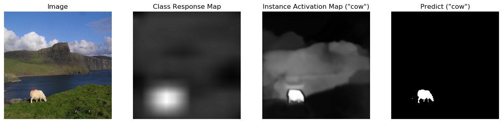
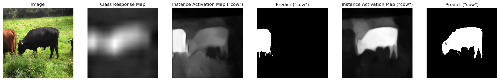
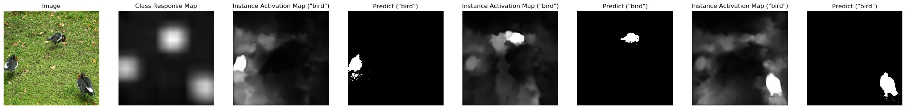
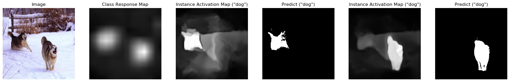

# simple-IAM
A simple PyTorch implementation of Learning Instance Activation Maps for Weakly Supervised Instance Segmentation, in CVPR 2019 (Spotlight)


A simple implementation as my homework, modified based on [ultra-thin-PRM](https://github.com/chuchienshu/ultra-thin-PRM).

Implementation details With my own understanding of the paper, it may be different from the author.

If you have any good suggestions, please let me know. Thank you !


## Sample result 












ps: Use dense CRF to generate predictions without adjusting the default parameters.


##  Weights and config

PRM_modules: https://drive.google.com/file/d/1L6czsneapAh_cX-rJpufT8V6wR-LfDxE/view?usp=sharing

Filling_modules: https://drive.google.com/file/d/1abHbPVftdyEP9lgnkx3ps2ok_5poVFtI/view?usp=sharing

config: https://drive.google.com/file/d/14vNYjj3ta8Edo9I3Pb8X16JRrfQ9FHOr/view?usp=sharing

```
simple-IAM
    ├── snapshots   
    │   ├── model_prm_latest.pth.tar
    │   ├── model_filling_latest.pth.tar
    │
    │── config.yml
```


##  Run demo

First download the shared weights and configuration and put them in the right place. Create a new directory   ```out```   as the output location. You can also change the folder path by editing ```config.yml```.

```
python main.py --run_demo=true
```


## Train

Dataset：VOC2012

Download the PASCAL-VOC2012 dataset:

```
wget http://host.robots.ox.ac.uk/pascal/VOC/voc2012/VOCtrainval_11-May-2012.tar
tar xvf VOCtrainval_11-May-2012.tar
```

Configure ```config.yml``` to determine the location of the dataset.


Train PRM modules: 

```
python main.py --train_prm=true
```


Train Filling modules: 

Download the proposals of VOC2012.

https://drive.google.com/file/d/1XOMxl89Mp6GzzYy8dBoQhsx04JY3XIU3/view?usp=sharing

Rename directory to ```ImageProposals``` after unzip and put it in the position shown below.

```
VOC2012
    ├── Annotations 
    ├── ImageProposals
    ├── ImageSets
    ├── JPEGImages
    ├── SegmentationClass
    ├── SegmentationObject
```
then:
```
python main.py --train_filling=true
```


If you want to continue the previous training, these two parameters may be helpful.

```--train_prm_resume=true``` and ```--train_filling_resume=true```


## Inference

Currently only inferences similar to VOC2012 structure are supported.

Configure ```config.yml``` to determine the location of the test dataset.

```
python main.py --run_demo=true
```


### Reference

```markdown
@article{Zhu2019IAM,
    title={{Learning Instance Activation Maps for Weakly Supervised Instance Segmentation}},
    author={Zhu, Y. and Zhou, Y. and Xu, H. and Ye, Q. and Doermann, D. and Jiao, J.},
    booktitle={CVPR},
    year={2019}
}
```
